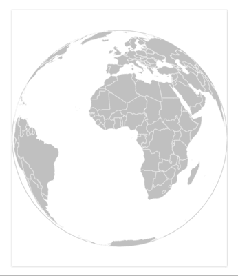

## Globe Map

A library for creating 3D like globe visualisation. We say 3D like because under the hood we are using D3 sphere projections instead of WebGL.



## Developing

- ``` npm run dev ``` to start up a webpack-dev-server which will serve the files and autorebuild & refresh as you develop.

**Important note:** Running the dev server will overwrite the final built file in the dist folder because I don't want have seperate build folders for dev and the final build. This makes it easier to link to one file in my examples and test both versions. 

**Just remember to run the build script once you are finished if you want to distribute the library.**

## Building

- ``` npm run build ``` to build the library. Do note that the example uses 


## Api

The class has very few options and a small api. 

Just check out the settings object and the class to get a sense of the possibilities.

## License

[Attribution 4.0 International (CC BY 4.0)](https://creativecommons.org/licenses/by/4.0/)

See Licese.md for more info.